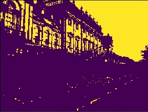

# Otsu Thresholding Method

**Python implementation of a basic Otsu thresholding algorithms.** 
Otsu's thresholding method involves iterating through all the possible threshold values and calculating a measure of spread for the pixel levels each side of the threshold (the pixels that either fall in foreground or background). The aim is to find the threshold value where the sum of foreground and background spreads is at its minimum.

## Dependencies
- Python 2.x
- numpy
- matplotlib
- PIL

## Input

## Output

- Text file contain the tracing of the Algorithm

## Links
 - [labbookpages](http://www.labbookpages.co.uk/software/imgProc/otsuThreshold.html)
 - [Wikipedia](https://en.wikipedia.org/wiki/Otsu%27s_method)
 

